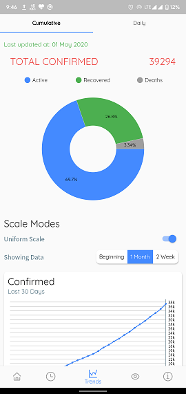
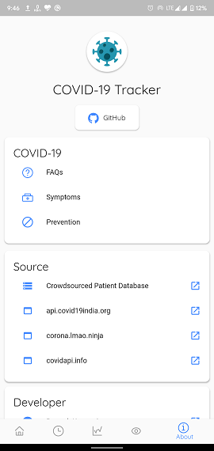

# COVID-19 Tracker

COVID-19 Tracker visualises Global COVID-19 data.

It provides real-time tally of COVID-19 patients in india (Global data added in v1.4.2). It covers global level, nation level and state level (only for India) cases.

### Do :star: the repo if you like it!

## Downloads

APK can be downloaded from [here](https://github.com/prateekKrOraon/covid-19-tracker/releases)

## Features
* Real-time updates of COVID-19 patients in India (Global data added in v1.4.2).
* State wise and district wise data available.
* Global data available (added in v1.4.2).
* Total number of tested people available (Source ICMR).
* Sorting of data available.
* Graphical representation of total confirmed, recovered and deceased cases and state wise graphical representation also available.
* Data represented through pie charts (added in v1.4.2) line charts and bar graphs for 14 days, 30 days and since beginning.
* State wise information of COVID-19 testing labs, Helpline numbers, Fundraisers and other public welfare organisations such as door-step delivery of essentials etc. available with their contact information.
* Light and Dark theme available.
* Available languages: English and Hindi.

## Features to be added
* State wise tested patient information.

## Problems
* Contributions are welcome. Please create a GH issue and discuss there before working on the same.
* Please raise an issue before submitting a pull request.

## Screenshots
                                    

## Data
* India data: [api.covid19india.org](https://api.covid19india.org) and [Crowdsourced Patient Database](https://docs.google.com/spreadsheets/u/1/d/e/2PACX-1vSz8Qs1gE_IYpzlkFkCXGcL_BqR8hZieWVi-rphN1gfrO3H4lDtVZs4kd0C3P8Y9lhsT1rhoB-Q_cP4/pubhtml)
* Global data: [corona.lmao.ninja](https://corona.lmao.ninja) and [covidapi.info](https://covidapi.info)

<<<<<<< HEAD
## Special thanks
Special thanks to these two guys for testing the app and giving feedback, suggestions and ideas. This app would have been a mess without you.
* [Udaishya Yadav](https://github.com/udaishya)
* [Pokala Anirudh](https://github.com/pokalaanirudh)

=======
>>>>>>> 3ed0282... License changed, Readme updated, code refactoring and bug fixing
## Disclaimer

COVID-19 Tracker does not collect any personal data, nor does it require access to Bluetooth, and is in no way meant to be an alternative to Aarogya Setu launched by Govt. of India. Aarogya Setu provides government guidelines to fight the pandemic and makes it easier to backtrack potential COVID-19 cases. It is strongly recommended that you download Aarogya Setu too.

## Plugins
* [url_launcher](https://github.com/flutter/plugins/tree/master/packages/url_launcher/url_launcher) by [Flutter](https://github.com/flutter)
* [intl](https://github.com/dart-lang/intl) by [Dart](https://github.com/dart-lang/)
* [flutter_icons](https://github.com/flutter-studio/flutter-icons) by [Flutter Studio](https://github.com/flutter-studio)
* [http](https://github.com/dart-lang/http) by [Dart](https://github.com/dart-lang/)
* [dynamic_theme](https://github.com/Norbert515/dynamic_theme) by [Norbert Kozsir](https://github.com/Norbert515/)
* [fl_chart](https://github.com/imaNNeoFighT/fl_chart) by [iman khoshabi](https://github.com/imaNNeoFighT/)
* [shared_preferences](https://github.com/flutter/plugins/tree/master/packages/shared_preferences/shared_preferences) by [Flutter](https://github.com/flutter)
* [package_info](https://github.com/flutter/plugins/tree/master/packages/package_info) by [Flutter](https://github.com/flutter)
* [intro_views_flutter](https://github.com/aagarwal1012/IntroViews-Flutter) by [Ayush Agarwal](https://github.com/aagarwal1012)

## License

    Copyright 2020 Prateek Kumar Oraon

    Licensed under the Apache License, Version 2.0 (the "License");
    you may not use this file except in compliance with the License.
    You may obtain a copy of the License at

        http://www.apache.org/licenses/LICENSE-2.0

    Unless required by applicable law or agreed to in writing, software
    distributed under the License is distributed on an "AS IS" BASIS,
    WITHOUT WARRANTIES OR CONDITIONS OF ANY KIND, either express or implied.
    See the License for the specific language governing permissions and
    limitations under the License.
