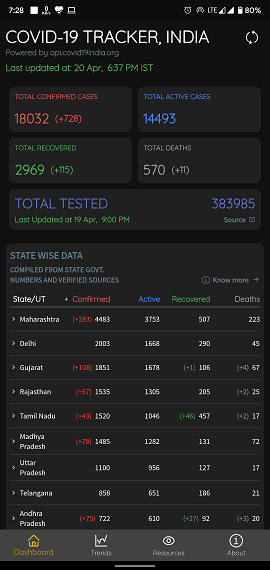
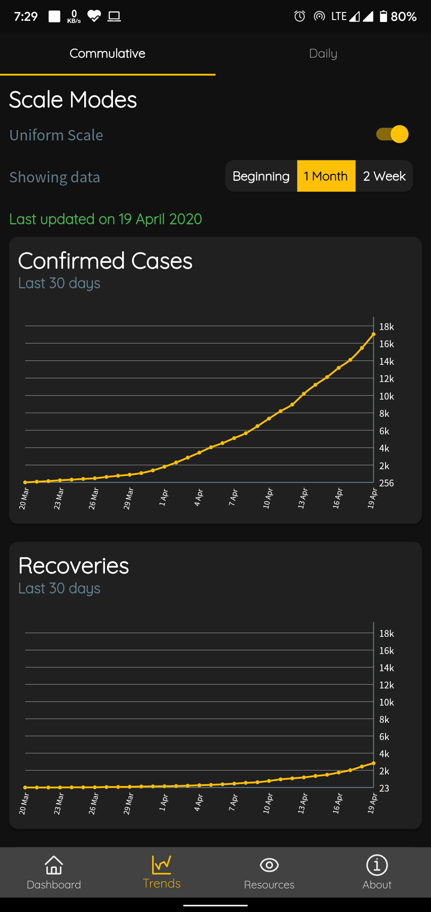
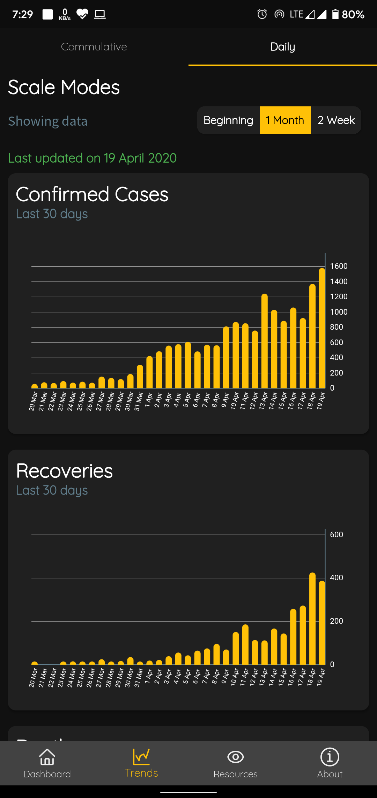
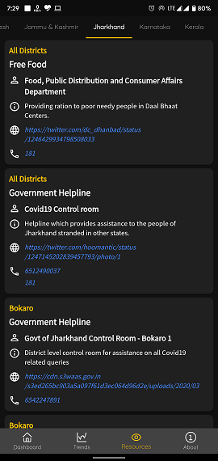
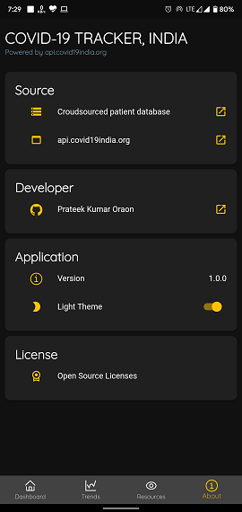
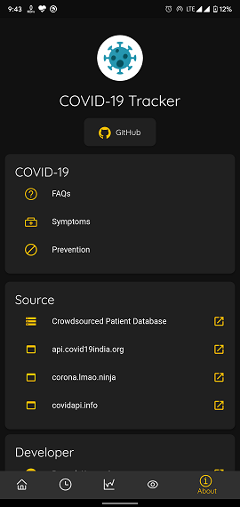
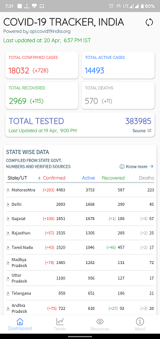
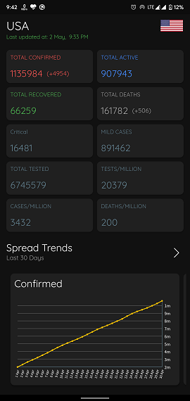
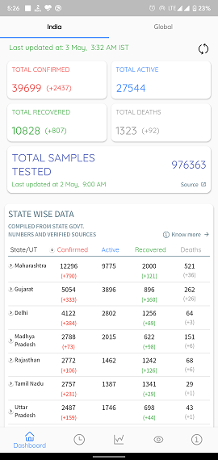

# COVID-19 Tracker

Android application to provide real-time tally of COVID-19 patients in india. It uses data from [api.covid19india.org](https://api.covid19india.org) and [Crowdsourced Patient Database](https://docs.google.com/spreadsheets/u/1/d/e/2PACX-1vSz8Qs1gE_IYpzlkFkCXGcL_BqR8hZieWVi-rphN1gfrO3H4lDtVZs4kd0C3P8Y9lhsT1rhoB-Q_cP4/pubhtml)

## Features
* Real-time updates of COVID-19 patients in India.
* State wise and distric wise data available.
* Total number of tested people avilable (Source ICMR).
* Sorting of data available.
* Graphical representation of total comfirmed, recovered and deceased cases and state wise graphical representation also available.
* Data represented through line charts and bar graphs for 14 days, 30 days and since beginning.
* State wise information of COVID-19 testing labs, Helpline numbers, Fundraisers and other public welfare organistaions such as door-step delivery of essentials etc. available with their contact information.
* Light and Dark theme available.

Note: All data is fetched from Crowdsourced patient database which are verified by group of volunteers.

## Features to be added
* State wise tested patient information.
* Hindi language support.

## Problems
* Feel free to put up a pull request or open an issue.

## Screenshots
                            

## Plugins
* [url_launcher](https://github.com/flutter/plugins/tree/master/packages/url_launcher/url_launcher) by [Flutter](https://github.com/flutter)
* [intl](https://github.com/dart-lang/intl) by [Dart](https://github.com/dart-lang/)
* [flutter_icons](https://github.com/flutter-studio/flutter-icons) by [Flutter Studio](https://github.com/flutter-studio)
* [http](https://github.com/dart-lang/http) by [Dart](https://github.com/dart-lang/)
* [dynamic_theme](https://github.com/Norbert515/dynamic_theme) by [Norbert Kozsir](https://github.com/Norbert515/)
* [fl_chart](https://github.com/imaNNeoFighT/fl_chart) by [iman khoshabi](https://github.com/imaNNeoFighT/)

## Getting Started

This project is a starting point for a Flutter application.

A few resources to get you started if this is your first Flutter project:

- [Lab: Write your first Flutter app](https://flutter.dev/docs/get-started/codelab)
- [Cookbook: Useful Flutter samples](https://flutter.dev/docs/cookbook)

For help getting started with Flutter, view our
[online documentation](https://flutter.dev/docs), which offers tutorials,
samples, guidance on mobile development, and a full API reference.
